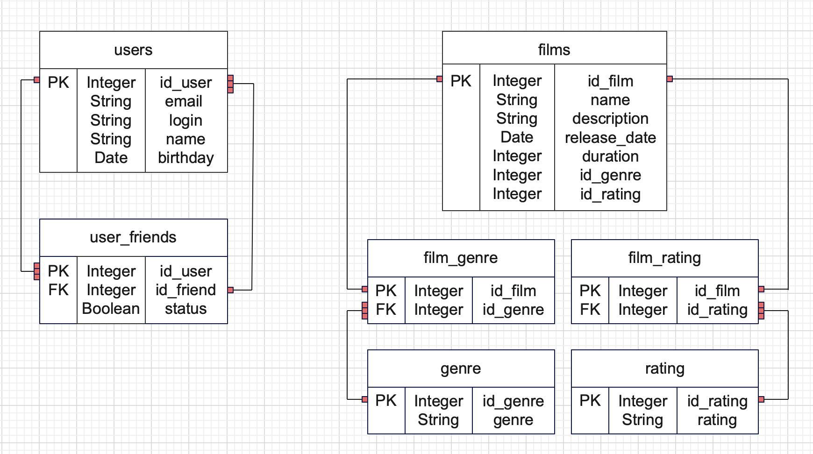

# ER-диаграмма:


### Создание таблиц:
```
CREATE TABLE IF NOT EXISTS users (
    id_user INTEGER PRIMARY KEY,
    email VARCHAR (100) NOT NULL,
    login VARCHAR (64) NOT NULL,
    name VARCHAR (64) NOT NULL,
    birthday DATE NOT NULL
);

CREATE TABLE IF NOT EXISTS users_friends (
    id_user INTEGER NOT NULL,
    id_friends INTEGER NOT NULL,
    status BOOLEAN NOT NULL,
    PRIMARY KEY (id_user, id_friends),
    FOREIGN KEY (id_friends) REFERENCES users(id_user)
);

CREATE TABLE IF NOT EXISTS films(
    id_film INTEGER PRIMARY KEY,
    name VARCHAR (200) NOT NULL,
    description VARCHAR (400) NOT NULL,
    release_date DATE NOT NULL,
    duration INTEGER NOT NULL,
    id_genre INTEGER NOT NULL,
    id_rating INTEGER NOT NULL
);

CREATE TABLE IF NOT EXISTS genre(
    id_genge INTEGER GENERATED BY DEFAULT AS IDENTITY PRIMARY KEY,
    genre VARCHAR (100) NOT NULL
);

CREATE TABLE IF NOT EXISTS rating(
    id_rating INTEGER GENERATED BY DEFAULT AS IDENTITY PRIMARY KEY,
    rating VARCHAR (100) NOT NULL
);

CREATE TABLE IF NOT EXISTS film_genre(
    id_film INTEGER NOT NULL PRIMARY KEY,
    id_genre INTEGER NOT NULL,
    FOREIGN KEY (id_genre) REFERENCES genre(id_genre)
);

CREATE TABLE IF NOT EXISTS film_rating(
    id_film INTEGER NOT NULL PRIMARY KEY,
    id_rating INTEGER NOT NULL,
    FOREIGN KEY (id_rating) REFERENCES rating(id_rating)
);

```
### Заполнение таблиц данными по жанрам и рейтингам:
```
INSERT INTO genre (genre)
  VALUES (`COMEDY`),
  VALUES (`DRAMA`),
  VALUES (`CARTOON`),
  VALUES (`THRILLER`),
  VALUES (`DOCUMENTARY`),
  VALUES (`ACTION`);
  
INSERT INTO rating (rating)
  VALUES (`G`),
  VALUES (`PG`),
  VALUES (`PG13`),
  VALUES (`R`),
  VALUES (`NC17`);
```
### Запросы к БД в соответствии с запросами контроллеров: 
- post/films:<br>
  film(1, "Limitless", "science fiction film", LocalDate.of(2011, 1, 1), 105, Genre.COMEDY, Rating.G);

```
INSERT INTO films 
    values ('1',
            'Limitless',
            'science fiction film',
            '2011-01-01',
            '105',
            (select id_genre from genre where genre = 'COMEDY'),
            (select id_rating from rating where rating = 'G'));
            
INSERT INTO film_genre (id_film, id_genre)
SELECT id_film, id_genre
FROM film
WHERE id = '1';
            
INSERT INTO film_rating (id_film, id_rating)
SELECT id_film, id_rating
FROM film
WHERE id = '1';            
```
- put/films:<br>
  film(1, "Limit", "science", LocalDate.of(2011, 1, 1), 105, Genre.COMEDY, Rating.G);
```
UPDATE films SET name = 'Limit', 
                 description = 'science',
                 '2011-01-01',
                 '105',
                 (select id_genre from genre where genre = 'COMEDY'),
                 (select id_rating from rating where rating = 'G')
WHERE id = '1';

UPDATE film_genre SET (id_film, id_genre) = 
    (SELECT id_film, id_genre
    FROM film
    WHERE id = '1');
    
UPDATE film_rating SET (id_film, id_rating) = 
    (SELECT id_film, id_rating
    FROM film
    WHERE id = '1');
```
- get/films:
```
SELECT f.id_film, f.name, f.description, f.release_date, f.duration, g.name, r.rating
FROM films AS f
INNER JOIN genre AS g ON f.id_genre = g.id_genre
INNER JOIN rating AS r ON f.id_rating = r.id_rating;
```
- post/users:<br>
  user(1, "mail@ya.ru", "PeterPan", "Peter", LocalDate.of(2000, 10, 10));
```
INSERT INTO users
  VALUE('1',
        'mail@ya.ru',
        'PeterPan',
        '2000-10-10')
```
- put/users:<br>
  user(1, "yandex@mail.ru", "Pan", "Peter", LocalDate.of(2000, 10, 10));
```
UPDATE users SET mail = 'yandex@mail.ru',
                login = 'Pan',
                name = 'Peter',
                birthday = '2000-10-10'
WHERE id = '1';
```
- get/users:
```
SELECT *
FROM users;
```